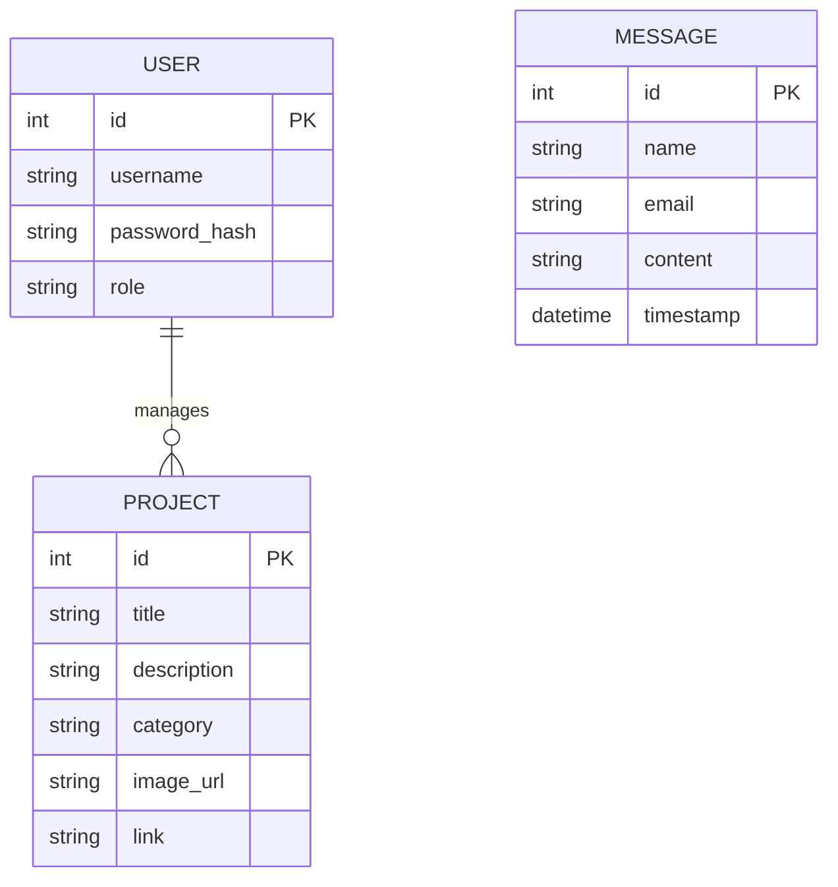
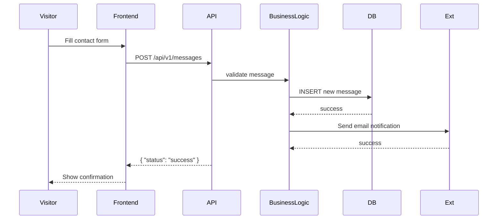
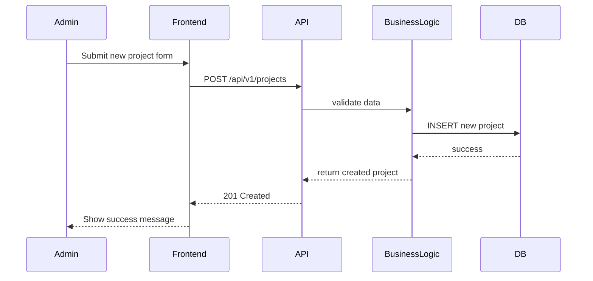

# Stage 3: Technical Documentation

## 1. User Stories & Mockups

### User Stories (prioritized with MoSCoW)

**Must Have**

* As a visitor, I want to view a list of projects, so that I can understand the developer’s experience.
* As an admin, I want to log in securely, so that I can manage portfolio content.
* As an admin, I want to add, edit, and delete projects, so that my portfolio stays updated.

**Should Have**

* As a visitor, I want to filter projects by category, so that I can quickly find relevant work.
* As a visitor, I want to send a message through a contact form, so that I can reach the developer easily.

**Could Have**

* As a visitor, I want to download the developer’s CV, so that I can review it offline.

**Won’t Have**

* As a visitor, I want to create my own account on the portfolio site. (Not in MVP scope)

### Mockups


* Projects page (list of projects with filter).
* Project detail page.
* Admin dashboard (CRUD for projects).
* Contact form.

(Mockups can be created using Figma/Balsamiq; include screenshots here if available.)

---

## 2. System Architecture

```mermaid
graph TD
  User[Visitor/Admin] -->|Browser| Frontend[Frontend (HTML/CSS/JS)]
  Frontend --> API[Backend API (Flask)]
  API --> BL[Business Logic Layer]
  BL --> DB[(Database: PostgreSQL)]
  API --> Ext[External Service: Email API]
```

---

## 3. Components, Classes, and Database Design

### Components

* **Frontend**: Static HTML/CSS/JS (with optional framework like React).
* **Backend API**: Flask REST API for projects, authentication, and messages.
* **Database**: PostgreSQL (tables for Users, Projects, Messages).
* **External Service**: Email API (e.g., SendGrid).

### Core Classes

* **User**: `id`, `username`, `password_hash`, `role`
* **Project**: `id`, `title`, `description`, `category`, `image_url`, `link`
* **Message**: `id`, `name`, `email`, `content`, `timestamp`

### Database Schema (ERD)



---

## 4. High-Level Sequence Diagrams

### Example: Visitor sends a message



### Example: Admin adds a new project



---

## 5. API Specifications

### Authentication

* **POST** `/api/v1/auth/login`
  Input: `{ "username": "admin", "password": "secret" }`
  Output: `{ "token": "jwt_token" }`

### Projects

* **GET** `/api/v1/projects` → List all projects
* **GET** `/api/v1/projects/{id}` → Get project by ID
* **POST** `/api/v1/projects` (Admin only)
  Input: `{ "title": "Portfolio", "description": "...", "category": "Web", "image_url": "...", "link": "..." }`
* **PUT** `/api/v1/projects/{id}` (Admin only)
* **DELETE** `/api/v1/projects/{id}` (Admin only)

### Messages

* **POST** `/api/v1/messages`
  Input: `{ "name": "Ali", "email": "ali@example.com", "content": "Hello" }`
  Output: `{ "status": "success", "messageId": 123 }`

---

## 6. SCM & QA Strategies

### Source Control (SCM)

* Platform: GitHub
* Branching: `main` (stable) + `feature/*` (new features)
* Workflow: Pull Requests, mandatory code reviews
* Protection: No direct commits to `main`

### Quality Assurance (QA)

* **Unit tests** for business logic and API routes (Pytest).
* **Integration tests** for DB operations and external services.
* **Static analysis**: Pylint/Flake8 for Python code.
* **CI/CD**: GitHub Actions pipeline (run tests on each PR).

---

## 7. Technical Justifications

* **Flask** chosen as backend framework: lightweight, flexible, suitable for MVP.
* **PostgreSQL** as database: relational model fits portfolio data (projects, messages, users).
* **JWT authentication**: stateless, simple to integrate with frontend.
* **Email API (SendGrid)**: reliable third-party service for sending notifications.
* **GitHub + Actions**: seamless integration for SCM and CI/CD.

---

## 📦 Deliverable

This document serves as the **Stage 3: Technical Documentation** for the Portfolio Project. It defines system architecture, database schema, APIs, testing strategy, and justifies technical decisions to guide implementation of the MVP.

