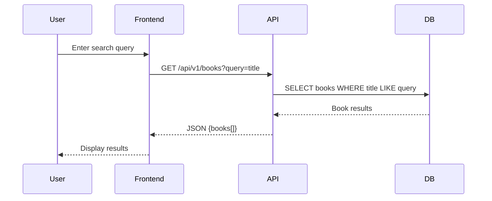

# 📄 Stage 3 – Technical Documentation (BookBridge)

This document consolidates all deliverables for Stage 3 of the **BookBridge Project**.  
It defines **user stories, mockups, architecture, database schema, sequence diagrams, API endpoints, and SCM/QA strategies**.  

---

## 📝 Task 0: Define User Stories and Mockups

### User Stories (MoSCoW Prioritization)

#### ✅ Must Have
- As a user, I want to search books by title, author, or category, so that I can quickly find the book I need.  
- As a user, I want to view book details (author, description, external links), so that I can learn more about each book.  
- As a user, I want to save favorite books, so that I can access them later in my account.  

#### 👍 Should Have
- As a user, I want the platform to link to trusted book resources, so that I can explore external information.  
- As a user, I want a responsive interface, so that I can access it on desktop and mobile.  

#### 💡 Could Have
- As a user, I want to sort and filter search results, so that I can refine what I’m looking for.  
- As a user, I want to see recommendations based on my favorites.  

#### 🚫 Won’t Have (MVP)
- Purchase books directly through the platform.  
- Social features (reviews, comments, discussions).  
- AI-based recommendations.  

---

### 📐 Mockups

**BookBridge Home Page**  
  

**Admin Dashboard**  
  

---

## 📝 Task 1: System Architecture

### High-Level Components
- **Frontend**: React web interface  
- **Backend**: Python + Flask (REST API)  
- **Database**: SQLite (development) → PostgreSQL (production)  
- **External APIs**: Optional for book metadata enrichment  

### Data Flow
User → Frontend → Backend API → Database / External APIs → Response → User  

### Architecture Diagram
```
graph TD
  User[User] -->|Browser| Frontend[Frontend (React)]
  Frontend --> API[Backend API (Flask)]
  API --> BL[Business Logic Layer]
  BL --> DB[(Database: PostgreSQL)]
  API --> Ext[External Services: Book APIs, Email API]
```
## 📝 Task 2: Components, Classes, and Database Design

### 2.1 Components / Services

#### **UserService**
- `create_user(data)`  
- `authenticate_user(email, password)`  
- `get_user_favorites(user_id)`  

#### **BookService**
- `search_books(query, filters)`  
- `get_book_details(book_id)`  
- `link_external_resources(book_id)`  

#### **FavoriteService**
- `add_to_favorites(user_id, book_id)`  
- `remove_from_favorites(user_id, book_id)`  
- `list_favorites(user_id)`  

### 2.2 Database Schema (ERD)
```
erDiagram
  USER ||--o{ FAVORITE : has
  USER {
    int id PK
    string name
    string email
    string password_hash
    datetime created_at
  }
  BOOK {
    int id PK
    string title
    string author
    string description
    string category
    string link
  }
  FAVORITE {
    int id PK
    int user_id FK
    int book_id FK
    datetime created_at
  }
```
## 📝 Task 3: Sequence Diagrams

### 3.1 Example: User Searches for a Book

### 3.2 Example: User Adds Book to Favorites
sequenceDiagram
  User->>Frontend: Click "Add to Favorites"
  Frontend->>API: POST /api/v1/favorites
  API->>DB: INSERT INTO favorites
  DB-->>API: success
  API-->>Frontend: {status: success}
  Frontend-->>User: Show confirmation
``

### 📝 Task 4: API Specifications

### 4.1 Authentication

**POST /api/v1/auth/login**  
- **Input:**  
```json
{
  "email": "user@example.com",
  "password": "secret"
}


ical Justifications
```

# Output:

{
  "token": "jwt_token"
}

# 4.2 Books

GET /api/v1/books?query=keyword → Search books

GET /api/v1/books/{id} → Get book details

# 4.3 Favorites

POST /api/v1/favorites

# Input:

{
  "book_id": 1
}


# Output:

{
  "status": "success"
}
```

GET /api/v1/favorites → List user’s favorites

DELETE /api/v1/favorites/{id} → Remove from favorites

---
```

## 📝 Task 5: SCM & QA Strategies

### 5.1 Source Control (SCM)

- **Platform:** GitHub  
- **Branching Strategy:**  
  - `main` → stable branch  
  - `dev` → integration  
  - `feature/*` → per feature  
- **Workflow:** Pull Requests with code reviews, no direct pushes to `main`

### 5.2 Quality Assurance (QA)

- **Unit Tests:** Pytest for backend logic  
- **Integration Tests:** API endpoints with Postman  
- **Frontend Tests:** React Testing Library  
- **Static Analysis:** Flake8 (Python), ESLint (JS)  
- **CI/CD:** GitHub Actions (lint + tests on PR)

## 📝 Task 6: Technical Justifications

- **Flask:** Lightweight, easy for rapid API development  
- **PostgreSQL:** Relational, scalable for production  
- **JWT Authentication:** Secure and stateless  
- **React:** Flexible and responsive frontend  
- **GitHub Actions:** Automated QA and CI/CD pipeline

## 📦 Final Deliverable

This Stage 3 document consolidates:

- **Task 0**: User Stories & Mockups  
- **Task 1**: System Architecture  
- **Task 2**: Components, Classes, Database Design  
- **Task 3**: Sequence Diagrams  
- **Task 4**: API Specifications  
- **Task 5**: SCM & QA Strategies  
- **Task 6**: Technical Justifications technical direction.

It provides a blueprint for MVP development and aligns the team on BookBridge’s 
